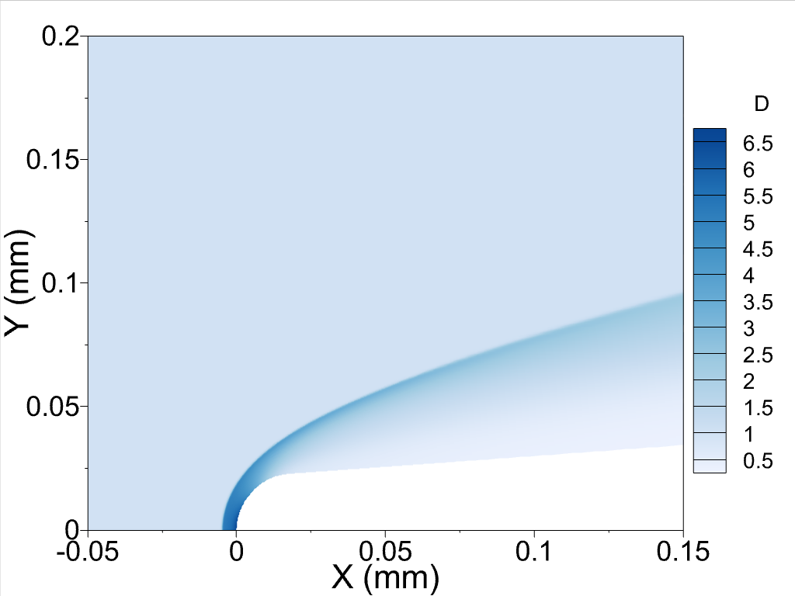

# Mesh and Solution File
The mesh used in Local Wall Cooling Effects on Hypersonic Boundary-Layer Stability journal paper.

The grid used in this study is shared in GitHub along with the density, velocity, and energy variables of the solution file for the adiabatic case without wall cooling. The mesh consists of 64 pieces which corresponds to 64 different outputs files from each parallel cores. Each mesh file has ten element long communication layer that is used in the communication between cores. The single file containing all mesh is not uploaded because of the size limitation of the GitHub.

  
  

The conditions of the flow is:

$$M=6$$

$$T=63.3K$$

$$Re=25.59\times10^6/m$$

Feel free to ask any question.

Furkan Oz

foz@okstate.edu
