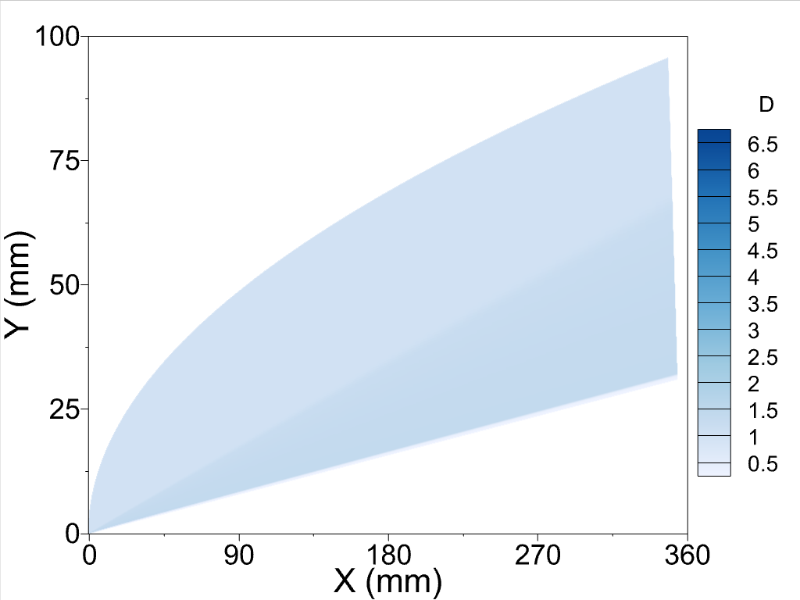
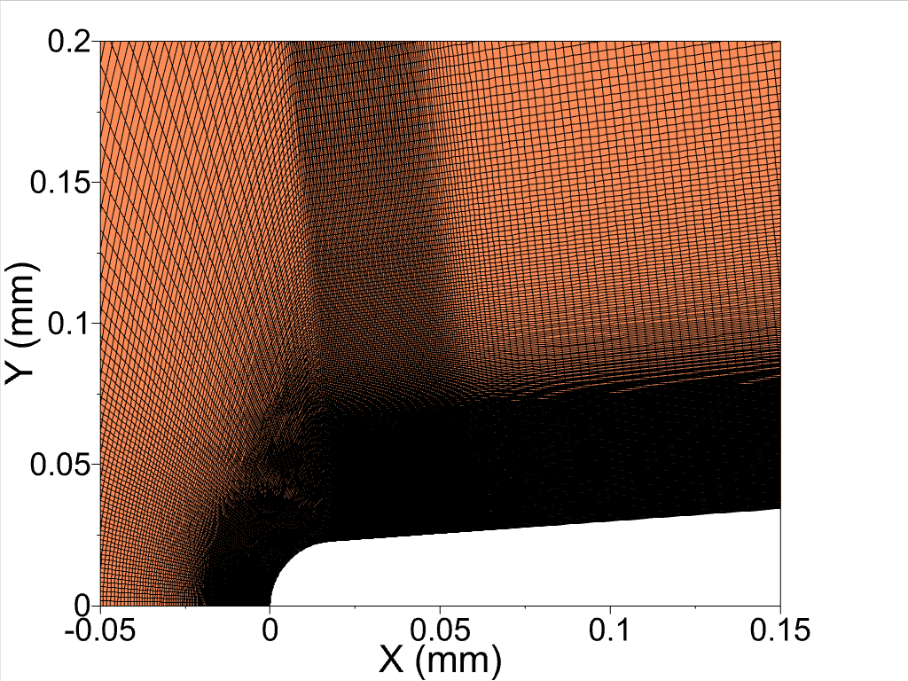
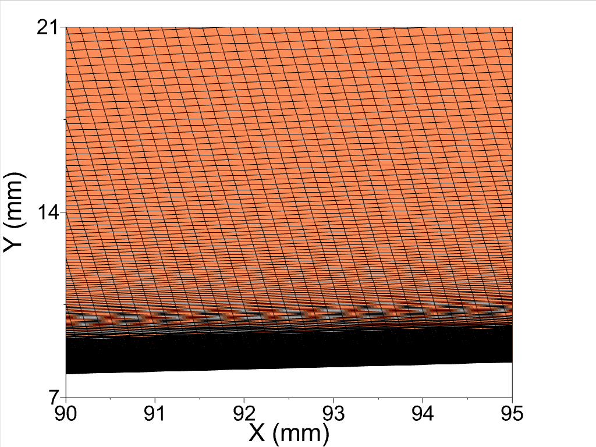

# Grid and Solution File
The grid used in Local Wall Cooling Effects on Hypersonic Boundary-Layer Stability journal paper.

The grid used in this study is shared in GitHub along with the density, velocity, and energy variables of the solution file for the adiabatic case without wall cooling. The grid consists of 64 pieces which corresponds to 64 different outputs files from each parallel cores. Each grid file has ten element long communication layer that is used in the communication between cores. The single file containing all mesh is not uploaded because of the size limitation of the GitHub. The grid is shared in Tecplot format along with the layout files that show plot density contour and the grid. The dimensions of physical coordinates (x,y) are mm and the solution variables are dimensionless. The nondimensionalization is done by their corresponding freestream values. Please refer to the journal paper for detailed information. The density contours close to nose and full domain is:

  
  

The grid used in the domain is:

  
  

The conditions of the flow is:

$$M=6$$

$$T=63.3K$$

$$Re=25.59\times10^6/m$$

Feel free to ask any question.

Furkan Oz

foz@okstate.edu
